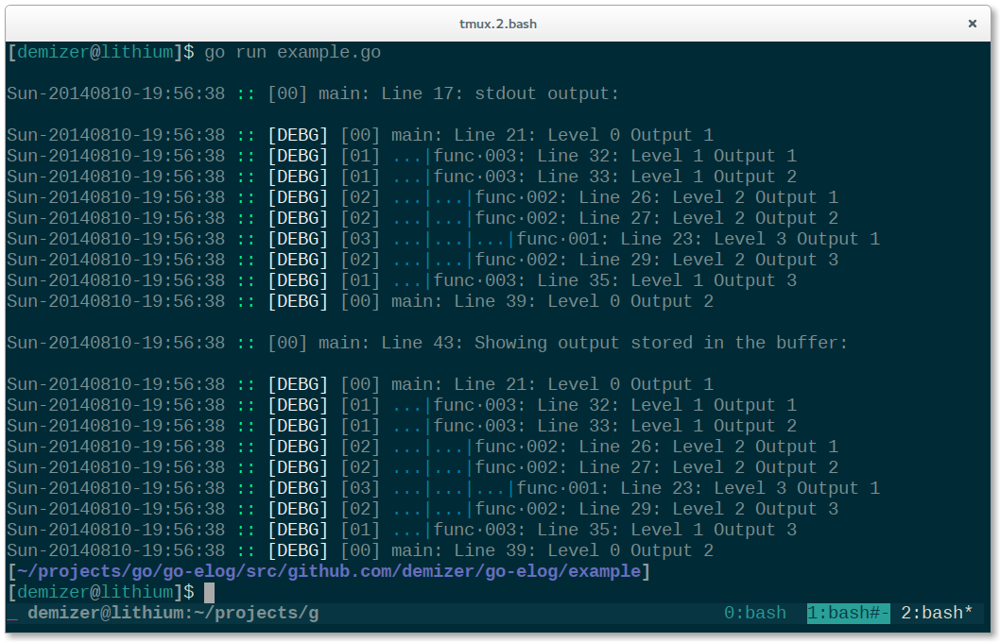

=================================
go-elog - Enhanced logging for Go
=================================

.. image:: https://travis-ci.org/demizer/go-elog.png?branch=master
    :target: https://travis-ci.org/demizer/go-elog
.. image:: https://drone.io/github.com/demizer/go-elog/status.png
    :target: https://drone.io/github.com/demizer/go-elog/latest
.. image:: https://coveralls.io/repos/demizer/go-elog/badge.png?branch=master
    :target: https://coveralls.io/r/demizer/go-elog?branch=master
.. image:: https://godoc.org/github.com/demizer/go-elog?status.svg
    :target: http://godoc.org/github.com/demizer/go-elog
|

A drop-in replacement for the Go standard library logger package.

--------
Features
--------

* Logging levels
* Colored text output
* Multiple simultaneous output streams
* Customizable output formatting using templates
* Hierarchical output formatting
* Suppress specific output

-------
Example
-------

Here is a simple example for using go-elog to hide debug output when not
needed.

.. code-block:: go

    import "github.com/demizer/go-elog"

    log.Println("This message will be sent to stdout.")
    log.Debugln("This message will only be shown on stderr if the logging level is DEBUG!")
